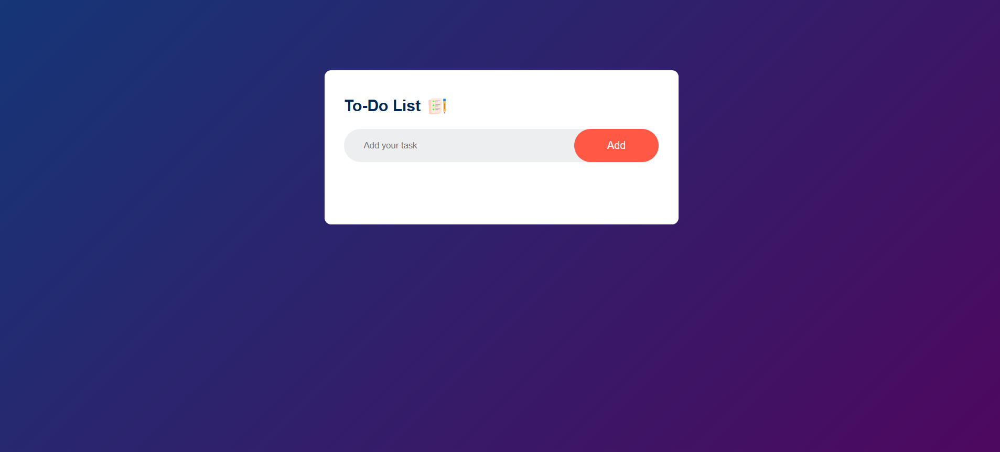

# 📝 To-Do List App

A simple and responsive **To-Do List Web Application** built using **HTML, CSS, and JavaScript**. The application allows users to add, complete, and delete tasks while automatically saving the task data in the browser using **Local Storage**.

## 🚀 Live Demo
https://nileshpadalwar.github.io/ToDOList/

## 📸 Application Screenshot



## 📌 Project Overview

The To-Do List App is a lightweight task-management application designed to demonstrate core front-end development concepts such as:

* DOM manipulation
* JavaScript event handling
* Dynamic HTML element creation
* Browser Local Storage
* Responsive UI design
* CSS styling and animations
* User interaction handling

Users can create tasks, mark tasks as completed, delete tasks, and retain their tasks even after refreshing the browser.

## ✨ Features

* ➕ **Add Tasks** – Quickly add new tasks to the list.
* ✅ **Complete Tasks** – Click a task to mark it as completed.
* ❌ **Delete Tasks** – Remove tasks using the delete button.
* 💾 **Persistent Storage** – Tasks are stored using browser `localStorage`.
* 🔄 **Data Persistence** – Tasks remain available after refreshing or reopening the page.
* 📱 **Responsive Design** – Works across desktop and mobile screen sizes.
* 🎨 **Modern UI** – Clean interface with gradient background and styled task components.

## 🛠️ Technologies Used

| Technology        | Purpose                                |
| ----------------- | -------------------------------------- |
| **HTML5**         | Application structure                  |
| **CSS3**          | Styling, layout and responsive design  |
| **JavaScript**    | Application logic and DOM manipulation |
| **Local Storage** | Persistent task storage                |

## 📂 Project Structure

```text
To-Do-List/
│
├── images/
│   ├── checked.png
│   ├── icon.png
│   └── unchecked.png
│
├── index.html
├── script.js
├── style.css
└── README.md
```

## ⚙️ How to Run the Project

### 1. Clone the Repository

```bash
git clone https://github.com/NileshPadalwar/ToDOList.git
```

### 2. Navigate to the Project

```bash
cd To-Do-List
```

### 3. Run the Application

Since this is a frontend project, no backend or package installation is required.

Simply open:

```text
index.html
```

in your web browser.

### 💡 Recommended

You can also run the project using **VS Code Live Server** for a better development experience.

## 🎯 Application Workflow

```text
User enters task
       ↓
     Click Add
       ↓
JavaScript creates <li>
       ↓
Task displayed in list
       ↓
Task saved to Local Storage
       ↓
User can complete/delete task
       ↓
Updated data saved automatically
```

## 💾 Local Storage

The application uses the browser's **Local Storage API** to persist tasks.

When a task is added, completed, or deleted, the task list is stored using:

```javascript
localStorage.setItem("data", listContainer.innerHTML);
```

When the application starts, previously saved tasks are retrieved using:

```javascript
localStorage.getItem("data");
```

This allows tasks to remain available even after the browser page is refreshed.

## 🧠 Key JavaScript Concepts Demonstrated

### DOM Manipulation

The application dynamically creates task elements using JavaScript:

```javascript
let li = document.createElement("li");
li.innerHTML = inputBox.value;
listContainer.appendChild(li);
```

### Event Handling

A click event listener is used to handle completing and deleting tasks:

```javascript
listContainer.addEventListener("click", function(e) {
    // Handle task actions
});
```

### CSS Class Manipulation

Completed tasks are handled using:

```javascript
e.target.classList.toggle("checked");
```

### Local Storage

Task information is persisted in the browser using:

```javascript
localStorage.setItem("data", listContainer.innerHTML);
```

## 📱 Responsive Design

The application uses flexible layouts and responsive CSS so that it can be used on:

* 💻 Desktop
* 💻 Laptop
* 📱 Mobile
* 📱 Tablet


## 👨‍💻 Author

**Nilesh Padalwar**

Frontend / Angular Developer

### Skills

`HTML` `CSS` `JavaScript` `TypeScript` `Angular`


### 📄 License

This project is created for learning  purposes.
